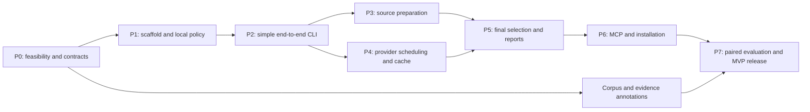

# JevGrep implementation plan

Prepared 2026-09-19. This is a plan for implementation, not a record of completed application work. The authoritative behavior is in [specification.md](specification.md); confirmed choices, accepted technical baseline, and alternatives are in [decisions.md](decisions.md).

## 1. Delivery strategy

Build a small usable search path early, then improve source preparation and reliability. Run the provider/layout experiment before investing heavily in sophisticated chunking or ranking. Keep the deterministic engine testable without a provider account. Expose the CLI before MCP so failures are easy to reproduce and benchmarks do not depend on the coding agent.

The first release serves one developer, one repository per server process, and JS/TS repositories up to approximately 100,000 lines as the target workload. This is not a hard size limit. Optional total-work and spending limits are off by default; controlled experiments explicitly enable their own budgets.



Milestones are outcomes, not calendar promises:

- **M0 — Feasible:** a supported Jev model accepts the intended request, and the batch layout decision has evidence.
- **M1 — Searchable:** the CLI returns exact snippets and a truthful report from a small fixture.
- **M2 — Reliable:** scope, source, cache, budgets, failures, and selection invariants pass deterministic checks.
- **M3 — Usable in Codex:** installation and actual stdio tool use work on Windows.
- **M4 — Measured:** paired results establish where the MVP helps and where it does not.

## 2. P0 — Resolve feasibility and freeze contracts

**Dependencies:** confirmed user decisions D1–D7; a Jev credential is needed only for live provider checks, not documentation or deterministic development.

**Work:**

1. Review the research notes against current primary docs; record chosen Node, Jev SDK, MCP SDK, TypeScript parser, and reference-tokenizer versions. Check supported Node LTS status and the SDK cancellation issue on the selected runtime.
2. Translate request, result, compact error, configuration, and diagnostic definitions into runtime schemas and types. Define stable codes, counter identities, unknown-usage semantics, and the output-budget contract before implementing network behavior.
3. Prepare a synthetic/public fixture of direct implementation evidence, caller/config/test evidence, weak matches, irrelevant material, and adversarial instruction-like comments.
4. Run a small explicitly budgeted Jev contract probe: authentication, pinned model identity, keyed Noul answers, usage fields, cancellation, missing/malformed response normalization, and request-limit errors. Use authorized synthetic/public content; no secret-bearing repository upload is needed.
5. Compare layout A (query state/excerpt questions), B (one excerpt state), and C (shared candidates) on the same frozen development fixture. Vary candidate order and batches of 1, 8, and 16; capture quality, usage, wall time, and contamination by irrelevant neighbors.
6. Choose the simplest layout that retains useful evidence. Provisional layout gate: zero schema/correlation failures; record all direct-evidence misses; a candidate must not drop any direct-evidence item retrieved by isolated evaluation on this small fixture at the development threshold. This is a feasibility gate, not a general recall claim. Expand the development set if tied or unstable.
7. Use a fake-provider stdio child process to prove SDK/Codex compatibility, one-copy output, cancellation, and maximum-payload visibility. Startup must work offline.

**Deliverables:** schemas, provider capability record with sources and exact versions, captured sanitized synthetic responses, chosen batch-layout rationale, tokenizer contract, and a small real-host smoke result.

**Done when:** the proposed request layout is either supported by evidence or replaced by an explicitly documented alternative; source-independent contract tests can be written without guessing provider behavior. Unknown account limits and price details are labeled rather than fabricated.

**Failure path:** if credentials are unavailable, complete the schemas/fake adapter and mark the live gate outstanding. If no layout preserves adequate relevance, stop expanding the implementation and revisit the hypothesis. If SDK cancellation is unreliable, test a narrow direct-HTTP adapter before changing the entire architecture.

## 3. P1 — Scaffold the package and enforce local policy

**Dependencies:** P0 contract definitions; this phase can proceed while live probing waits for account access.

**Work:**

1. Create one TypeScript package, a lockfile, build/type-check/test scripts, and an executable entry point. Keep production and test dependencies explicit. Do not add a monorepo framework.
2. Implement strict trusted-config loading with no executable repository configuration. Add environment-based credential lookup, provider-host validation, caps represented as nullable fields, and validated defaults.
3. Implement `doctor` with redacted output, configuration validation, and zero network calls by default.
4. Implement repository canonicalization and requested-scope validation for Windows and POSIX paths. Exclude symlinks/junctions/reparse points and denied path forms.
5. Implement cancellation/deadline propagation and bounded metadata-only diagnostics as shared lifecycle utilities, not global mutable state.
6. Add synthetic fixtures for root escapes, ignored paths, credentials, malformed config, special filenames, overlapping scopes, and disabled remote disclosure.

**Deliverables:** buildable executable, strict config/error schema, local `doctor`, authorization module, offline test harness, initial CI.

**Done when:** invalid configuration or unauthorized scopes cause no external request; the package starts on Windows and Linux; default logs reveal no credentials, source, or complete queries. The test suite runs without a provider key.

## 4. P2 — Deliver the first complete CLI search

**Dependencies:** P1; chosen provider request shape or its recorded adapter equivalent from P0.

**Work:**

1. Read a small eligible scope into original snapshots with byte hashes, line mappings, and deterministic path order.
2. Implement the line-window fallback first. It must preserve all eligible source lines and handle oversized windows explicitly.
3. Implement the fake/recorded evaluator and a minimal live adapter with runtime result validation and hidden SDK retries disabled.
4. Implement a basic threshold/ranking selector with exact source slices and a pinned reference-token counter.
5. Wire `inspect` and `search --json` through the shared engine; add human CLI rendering only after canonical JSON is correct.
6. Account for the full payload, preflight the mandatory envelope, and handle empty/no-fit/failed outcomes.

**Deliverables:** one working vertical path from query and scope to original excerpts, CLI JSON output, end-to-end synthetic fixture tests.

**Done when:** a known fixture question returns the expected original code range, every code slice matches its snapshot, no score is invented on provider failure, and the complete serialized result fits its response budget. A local-only inspection is possible without remote permission or credentials.

**Milestone:** M1. This is a development milestone, not yet the advertised MVP.

## 5. P3 — Implement reliable inventory and JS/TS chunking

**Dependencies:** P2. Can run alongside P4 after internal schemas are stable.

**Work:**

1. Finish deterministic discovery and ignore semantics, including nested ignore rules, eligible untracked files, dependency/generated exclusions, unsupported encoding/binary detection, and credential-pattern quarantine.
2. Record exclusion categories, unreadable/traversal errors, unknown counts under excluded directories, and partial inventory. Ensure optional total-scan caps are truly disabled when null.
3. Add the TypeScript syntax parser. Preserve declarations, methods, comments/decorators, imports, exports, top-level route/event registrations, and unclaimed source spans.
4. Split oversized ranges into bounded contiguous windows with controlled overlap. Handle malformed code through fallback rather than dropping it.
5. Support common text config/SQL/Markdown via fallback. Keep policy clearly separate from relevance selection.
6. Implement selected-file hash revalidation and stale-source omission. Source snapshots are per-file captures; document the lack of an atomic whole-tree snapshot.
7. Add source-fidelity and coverage checks for LF/CRLF, BOM, Unicode/astral characters, no final newline, long lines, parser errors, and overlapping scopes.

**Deliverables:** production candidate inventory/chunker, fixture corpus, source-range invariants, local `inspect` report with estimated work.

**Done when:** every nonblank line in every eligible prepared fixture is covered; no generated/reprinted source appears in results; unauthorized bytes never reach the evaluator; all skips and incomplete preparation are visible.

## 6. P4 — Add complete scheduling, accounting, and exact cache reuse

**Dependencies:** P2 and P0's measured provider layout. Can run alongside P3.

**Work:**

1. Implement deterministic batches satisfying both documented provider context constraints with configurable headroom. Oversized individual fragments must be resolved before dispatch.
2. Implement concurrency permits, one active search with a small bounded queue, internal deadline, finite retries per batch, and cancellation of pending/in-flight work.
3. Own every request attempt. Disable SDK retries, respect retry-after signals, classify terminal versus retryable errors, and keep ambiguous paid retry opt-in.
4. Implement atomic usage reservations against enabled caps. Keep first-attempt preflight estimates separate from actual usage. Include request wrappers, state, questions, retries, and in-flight attempts.
5. Reconcile known usage while retaining conservative unknown reservations. No missing usage value becomes zero. Report estimate overruns without stopping an uncapped scan merely because an estimate was low.
6. Implement exact evaluation identity and the local score-only cache, including repository namespace, transmitted path/state, template/layout/model versions, TTL, size eviction, corruption recovery, atomic writes, and `cache clear`.
7. Define independent cache reuse only after layout/state invariance is demonstrated. Keep threshold, response-size, deadline, and spending-policy changes outside semantic score identity when model input is unchanged.
8. Add scheduler and cache tests with simulated 401/429/5xx, delayed responses, ambiguous timeout, unknown usage, overlapping requests, corrupted entries, and model alias changes.

**Deliverables:** evaluator scheduler, live adapter, score cache, known/unknown usage accounting, complete/partial/rejected states.

**Done when:** fake-provider tests prove no enabled dispatch cap can be oversubscribed by concurrency or retries; caps-off runs do not stop at hidden product thresholds; cancellation cleans up in a subprocess test; a repeated identical evaluation makes zero unnecessary provider calls.

## 7. P5 — Finish selection, rendering, and observable reports

**Dependencies:** P3 and P4.

**Work:**

1. Implement the specified deterministic threshold/rank/merge/fit algorithm. Preserve distinct-file provenance even for identical source text.
2. Support overlaps and adjacency without joining disjoint ranges. Skip oversized candidates and keep searching for later candidates that fit.
3. Finalize selected-source revalidation: validate newly introduced replacement files, never reintroduce stale files, and bound the procedure.
4. Implement exact terminal count identities, no-result precedence, cache-versus-remote counts, preflight estimates, enabled-limit reporting, and sanitized reason codes.
5. Bound metadata before paid work; validate final serialization after every removal. Store measured response-token count in local diagnostics to avoid counting it recursively.
6. Add the human CLI renderer with separately measured payload size. Verify semantic parity with JSON.
7. Run property-based or broad parameterized checks for interval unions, exact source slices, token-fit behavior, and stable tie handling. Add only tests that exercise meaningful invariants.

**Deliverables:** stable v1 result contract, full renderer, useful partial/error reports, CLI help and examples.

**Done when:** all R1–R10 deterministic acceptance cases pass, including no-fit, all-stale, incomplete inventory, preflight cache hits, mixed known/unknown billing, and long-path metadata. No response falsely implies task completeness or absence.

**Milestone:** M2.

## 8. P6 — Connect Codex and make installation repeatable

**Dependencies:** P5; P0 SDK compatibility probe.

**Work:**

1. Expose only `semantic_search_code` through the official MCP SDK; use one canonical JSON text block and no misleading output schema.
2. Map protocol errors, tool execution errors, complete results, and partial results exactly as specified. Keep stdout protocol-clean.
3. Implement protocol-aware progress where the client supports it. Cancellation must end dispatch and prevent new post-cancel result emission; EOF shuts down cleanly.
4. Provide a version-pinned local installation method and launch instructions using absolute executable/configuration paths. Do not download an unpinned package at every MCP startup.
5. Document user-owned trusted configuration, environment-variable credential forwarding, optional cap setup, local-only inspect, longer searches, and cache clearing.
6. Configure/test Codex outer timeout and output truncation allowance relative to the permitted JevGrep response. Avoid treating progress as an extension of the host deadline.
7. Run a real Codex smoke task: behavior search, follow-up question, ordinary symbol/file read, and normal agent continuation. JevGrep must not edit code or start an autonomous investigation.
8. Exercise startup offline, no key, provider outage, client cancellation, internal deadline, maximum configured response, and stderr logging on Windows and Linux.

**Deliverables:** installable package artifact, MCP adapter, setup/troubleshooting guide, pinned compatibility matrix, actual host smoke evidence.

**Done when:** the user can follow the installation guide on a clean environment and Codex can call the tool with exact excerpts, complete JSON, and truthful status. No raw secret appears in configuration examples, logs, or output.

**Milestone:** M3, the first usable experimental open-source MVP.

## 9. P7 — Evaluate the hypothesis and decide the next iteration

**Dependencies:** M3; corpus work starts during P0 and continues in parallel.

**Work:**

1. Finish a versioned retrieval development/held-out split with at least 30 behavior questions and 10 exact-symbol controls across at least three repository fixtures. Include config, tests, top-level wiring, cross-file investigation, duplicate-heavy code, and no-match cases.
2. Freeze source revisions and evidence labels; keep answer keys/reference fixes outside the agent-visible checkout. Record alternative valid evidence sets.
3. Tune only on development examples: batch width, threshold, fragment size, and the simple ranker. Freeze settings before held-out evaluation.
4. Run retrieval experiments with cold and warm cache separately. Include partial/failed scans in reporting.
5. Run approximately 10 paired end-to-end smoke tasks for the first personal release. Use identical main-agent settings, starting checkouts, ordinary tools, task limits, and objective completion checks. B adds JevGrep availability without forcing use.
6. Collect total-task success, main-agent usage, Jev usage, combined estimated/billed cost where available, wall time, search/read count, context, recovery work, and tool adoption. Record unknown accounting.
7. Review every regression. A smaller context payload is insufficient evidence if task success drops or total time/cost rises.
8. If the smoke results are encouraging, expand to a 20–30-task pilot with repeated runs, then choose a powered held-out study and an explicit success-rate tolerance before public claims.
9. Decide: retain as a personal tool, narrow its supported use cases, revise layout/chunking, or stop. Only then consider complementary-evidence selection, more languages, or a lexical/embedding alternative as a separate experiment and explicit scope change.

**Deliverables:** benchmark manifests, raw bounded telemetry, reproducible commands, comparison report, known limitations, next-iteration decision.

**Done when:** the report includes negative results, costs of failed calls, tail latency, task success, and cold/warm cache separation. The first release is accurately labeled experimental if the product hypothesis remains unproven.

**Milestone:** M4.

## 10. Proposed repository layout

This is a future layout; only documentation exists now. Keep one package until real distribution needs justify splitting it.

```text
jevgrep/
  README.md
  CONTEXT.md
  package.json
  tsconfig.json
  src/
    cli.ts
    mcp.ts
    config.ts
    contracts.ts
    engine.ts
    source/
      authorization.ts
      inventory.ts
      snapshot.ts
      chunker.ts
    evaluation/
      jev.ts
      scheduler.ts
      accounting.ts
      cache.ts
    response/
      selection.ts
      render.ts
      token-counter.ts
  tests/
    fixtures/
    contract/
    integration/
  benchmarks/
    manifests/
    retrieval/
    agent-tasks/
  docs/
    specification.md
    implementation-plan.md
    decisions.md
    research/
```

Directory names are a proposed organization, not a demand to create one abstraction per file. Keep related invariants together if that yields a simpler implementation. Use public interfaces for meaningful tests; avoid testing private implementation details merely to match this diagram.

## 11. Parallel work and integration order

For a team of one junior, one intermediate, and one senior developer, use the [three-person workflow](workflow-equipe.md) and the ownership fields in [the issue backlog](issues.md). This staffing proposal preserves the dependencies and acceptance criteria below; work against a simulated interface does not close an outstanding integration requirement.

After P0/P1 establish contracts, source preparation (P3), scheduler/cache (P4), and corpus annotation can run independently. One owner maintains `contracts.ts`; changes to shared result/budget semantics must be integrated before parallel branches extend them. Selection/rendering (P5) owns the final response accounting and consumes stable preparation/evaluation outputs. MCP (P6) is an adapter over the tested engine, not a second implementation.

A personal implementation can execute the same plan sequentially. Initial effort estimate is **20–35 focused engineering days** for a reliable measured MVP, with the first narrow CLI path expected materially earlier. This is a planning range, not a commitment: provider access, batching quality, SDK compatibility, corpus preparation, and agent-benchmark variability are the main uncertainties. Re-estimate after M0 and M1; do not promise a release date from this document alone.

## 12. Main risks and responses

| Risk | Early signal | Response / decision |
| --- | --- | --- |
| Jev relevance too weak or batch-sensitive | Direct evidence missed under layout changes | P0 layout comparison; retain isolated baseline and revise before expansion |
| Whole-scope latency too high | Provider time dominates even at moderate scope | Measure batch/concurrency, guide scoped queries, support adjustable timeout; revisit product economics |
| Token/USD estimates inaccurate | Reported usage diverges from estimates | Preserve known/unknown accounting, calibrate estimator; do not claim exact invoice cap |
| Data disclosure surprises | Operator cannot explain which files are sent | Explicit remote setup, local inspect, exclusions and destination visibility |
| Source/path bugs | Wrong lines, stale hashes, link escape fixtures | Enforce invariants before live provider usage; Windows coverage from the start |
| SDK/client drift | Broken cancellation or host truncation | Pin versions, subprocess smoke checks, narrow adapters |
| Benchmark overstates gains | Wins depend on warm cache or forced tool use | Cold/warm separation, voluntary use, paired task outcomes, fixed held-out sets |
| Experimental MVP turns into a platform | Multiple servers, languages, graph search before a useful CLI | Preserve current scope and require evidence for the next feature |

## 13. Deferred work, explicitly gated

Complementary selection needs a demonstrated improvement over the simple ranker. Multi-language parsing needs a real repository workload beyond JS/TS. Streaming or resumable scans need evidence that timeouts dominate ordinary use. Public packaging needs license and distribution choices. Team use needs a separate data-governance, deployment, and operational design. A vector or lexical prefilter would alter the v1 hypothesis and requires an explicit new decision.

The next implementation action is **P0: contracts and feasibility**. Product choices and the engineering baseline are settled; concrete provider behavior is tested there. This planning task has produced documentation only.
